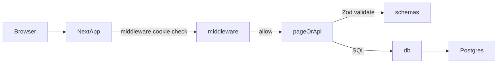
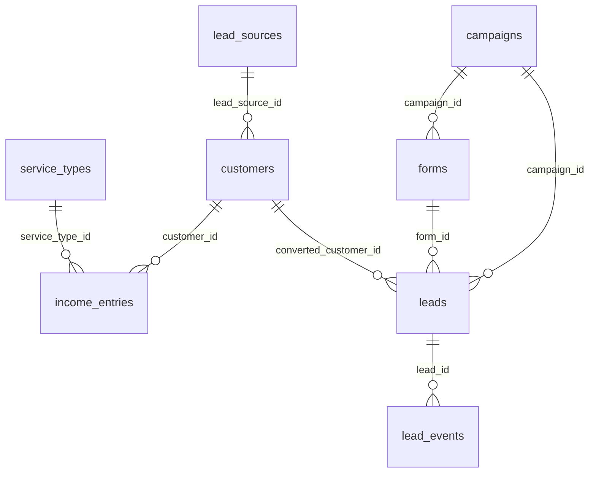

# Mai Cosmetics (מאי קוסמטיקס)

Internal Hebrew (RTL) business dashboard for tracking **income sessions**, **expenses**, **customers**, **service types**, and a full **marketing funnel**: **campaigns → forms → leads → customers**, including attribution and reporting.

## Quick start (local)

### Prerequisites

- Node.js (LTS recommended)
- Postgres database (commonly Vercel Postgres)

### Environment variables

Copy [`.env.example`](.env.example) → `.env.local` and fill:

- **`DATABASE_URL`**: Postgres connection string
- **`ADMIN_PASSWORD`**: single admin password used for all access
- **`NEXT_PUBLIC_BASE_URL`** (optional): base URL for server components fetching API. Defaults to `http://localhost:3000` in [`src/app/page.tsx`](src/app/page.tsx).

### Run

```bash
npm install
npm run dev
```

Open `http://localhost:3000` → you will be redirected to `/login` until you authenticate.

## How the app is organized (where to change things)

### High-level directory map

| Area | Path | What to change here |
|------|------|---------------------|
| **Pages (UI routes)** | [`src/app/`](src/app/) | Each folder is a route segment; `page.tsx` is the screen |
| **API routes** | [`src/app/api/`](src/app/api/) | REST-style endpoints (`income`, `expenses`, `customers`, …) |
| **Auth gate** | [`src/middleware.ts`](src/middleware.ts) | Redirect-to-login enforcement for all non-allowed paths |
| **DB access** | [`src/lib/db.ts`](src/lib/db.ts) | `sql` / `query()` wrapper around Vercel Postgres |
| **HTTP helpers** | [`src/lib/http/`](src/lib/http/) | `withApiHandler`, `json`, `ApiError`, `parseJsonBody`, `parseSchema`, Postgres error mapping |
| **Server → own API** | [`src/lib/server-fetch.ts`](src/lib/server-fetch.ts) | RSC-only `serverFetch`: forwards `Cookie` + correct origin for middleware-protected `/api/*`. Client pages use `fetch('/api/...')` (browser sends cookies). |
| **Validation** | [`src/lib/validation/`](src/lib/validation/) | Zod schemas by domain (barrel: [`src/lib/schemas.ts`](src/lib/schemas.ts)) |
| **API client (browser)** | [`src/lib/api-client.ts`](src/lib/api-client.ts), [`src/lib/api-error-toast.ts`](src/lib/api-error-toast.ts) | Typed `fetch` + Hebrew toasts for `409` / `429` / validation |
| **Domain types** | [`src/types/index.ts`](src/types/index.ts), [`src/types/api.ts`](src/types/api.ts) | Row/payload interfaces + shared API error / pagination types |
| **Business calculations** | [`src/lib/calculations.ts`](src/lib/calculations.ts) | Dashboard aggregates and trend logic |
| **Translations** | [`src/lib/translations.ts`](src/lib/translations.ts) | All user-visible Hebrew strings (source of truth) |
| **Navigation** | [`src/components/NavigationBar.tsx`](src/components/NavigationBar.tsx) | Sidebar/mobile nav; add/remove top-level sections |
| **Shared UI primitives** | [`src/components/ui/`](src/components/ui/) | Buttons, inputs, selects, toast, empty state |
| **Feature components** | [`src/components/forms/`](src/components/forms/), [`src/components/entries/`](src/components/entries/), [`src/components/dashboard/`](src/components/dashboard/) | Tables, forms, charts, dialogs |
| **Sortable / drag-reorder** | [`src/components/sortable/`](src/components/sortable/) | `@dnd-kit` table wrappers ([`SortableTableRoot`](src/components/sortable/SortableTableRoot.tsx), [`SortableTableBody`](src/components/sortable/SortableTableBody.tsx), [`SortableTableRow`](src/components/sortable/SortableTableRow.tsx)); used on lead sources and service types lists |

### Request/data flow (mental model)



## Authentication (single-password admin)

### What protects the app

- **Middleware**: [`src/middleware.ts`](src/middleware.ts)
  - Cookie name: **`admin_auth`**
  - Cookie value: **SHA-256 hex hash of `ADMIN_PASSWORD`**
  - If missing/invalid → redirect to `/login?next=<original_path>`
  - Allowed without auth:
    - `/login`
    - `/f/*` (public lead forms)
    - `/api/admin/login`
    - `/api/admin/logout`
    - `/api/public/*` (public form APIs)
    - Next.js/static assets (`/_next/*`, favicon, manifest)

### Login/logout endpoints

- **POST** `/api/admin/login` → [`src/app/api/admin/login/route.ts`](src/app/api/admin/login/route.ts)
  - Body: `{ password: string, next?: string }`
  - On success: sets `admin_auth` cookie for **30 days**, returns `{ redirectTo }`
  - On failure: `401 { error: "Invalid password" }`
- **POST** `/api/admin/logout` → [`src/app/api/admin/logout/route.ts`](src/app/api/admin/logout/route.ts)
  - Clears the cookie

### Troubleshooting auth

- **`Missing ADMIN_PASSWORD env var`**: set `ADMIN_PASSWORD` in `.env.local` (or deployment env).
- **Redirect loop to `/login`**: password mismatch (cookie hash doesn’t match current `ADMIN_PASSWORD`), or cookie not being set (check browser cookies).

## Database schema (source of truth = `migrations/`)

The schema is defined by SQL migrations in [`migrations/`](migrations/). Apply them **in numeric order** (001 → 014) to a Postgres database referenced by `DATABASE_URL`.

> There is no automated migration runner script in this repo today; migrations are intended to be run manually (or via your deployment/DB tool of choice) in order.

### Entity relationships



### Tables (columns, constraints, indexes)

#### `service_types`

Migrations:
- [`migrations/001_create_service_types.sql`](migrations/001_create_service_types.sql)
- [`migrations/005_add_default_price_to_service_types.sql`](migrations/005_add_default_price_to_service_types.sql)
- [`migrations/009_add_default_duration_to_service_types.sql`](migrations/009_add_default_duration_to_service_types.sql)
- [`migrations/014_add_sort_order_to_service_types.sql`](migrations/014_add_sort_order_to_service_types.sql)
- Seed: [`migrations/002_seed_service_types.sql`](migrations/002_seed_service_types.sql)

Columns:
- **`id`**: `SERIAL PRIMARY KEY`
- **`name`**: `VARCHAR(100) NOT NULL UNIQUE`
- **`default_price`**: `NUMERIC(10,2)` nullable (suggested price when logging income)
- **`default_duration`**: `INTEGER` nullable (suggested duration in minutes when logging income)
- **`sort_order`**: `INTEGER NOT NULL DEFAULT 0` (display order; drag-reorder in UI + [`PUT /api/service-types/reorder`](src/app/api/service-types/reorder/route.ts))
- **`created_at`**: `TIMESTAMPTZ DEFAULT NOW()`

#### `income_entries`

Migrations:
- [`migrations/003_create_income_entries.sql`](migrations/003_create_income_entries.sql)
- [`migrations/008_add_customer_to_income.sql`](migrations/008_add_customer_to_income.sql)

Columns:
- **`id`**: `SERIAL PRIMARY KEY`
- **`service_name`**: `VARCHAR(255) NOT NULL`
- **`service_type_id`**: `INTEGER NOT NULL REFERENCES service_types(id)`
- **`customer_id`**: `INTEGER NULL REFERENCES customers(id)`
- **`date`**: `DATE NOT NULL`
- **`duration_minutes`**: `INTEGER NOT NULL CHECK (duration_minutes > 0)`
- **`amount`**: `NUMERIC(10,2) NOT NULL CHECK (amount > 0)`
- **`created_at`**: `TIMESTAMPTZ DEFAULT NOW()`

Indexes:
- `income_entries_date_idx` on `(date)`
- `income_entries_service_type_idx` on `(service_type_id)`
- `income_entries_customer_id_idx` on `(customer_id)`

#### `expense_entries`

Migration: [`migrations/004_create_expense_entries.sql`](migrations/004_create_expense_entries.sql)

Columns:
- **`id`**: `SERIAL PRIMARY KEY`
- **`description`**: `VARCHAR(255) NOT NULL`
- **`category`**: `VARCHAR(50) NOT NULL CHECK (category IN ('equipment','materials','consumables','other'))`
- **`date`**: `DATE NOT NULL`
- **`amount`**: `NUMERIC(10,2) NOT NULL CHECK (amount > 0)`
- **`created_at`**: `TIMESTAMPTZ DEFAULT NOW()`

Indexes:
- `expense_entries_date_idx` on `(date)`
- `expense_entries_category_idx` on `(category)`

#### `lead_sources`

Migration + seed: [`migrations/006_create_lead_sources.sql`](migrations/006_create_lead_sources.sql)

Columns:
- **`id`**: `SERIAL PRIMARY KEY`
- **`name`**: `VARCHAR(100) NOT NULL UNIQUE`
- **`sort_order`**: `INTEGER NOT NULL DEFAULT 0`
- **`created_at`**: `TIMESTAMPTZ DEFAULT NOW()`

Indexes:
- `lead_sources_sort_order_idx` on `(sort_order)`

#### `customers`

Migration: [`migrations/007_create_customers.sql`](migrations/007_create_customers.sql)

Columns:
- **`id`**: `SERIAL PRIMARY KEY`
- **`first_name`**: `VARCHAR(100) NOT NULL`
- **`last_name`**: `VARCHAR(100) NOT NULL`
- **`phone`**: `VARCHAR(50)` nullable
- **`email`**: `VARCHAR(255)` nullable
- **`lead_source_id`**: `INTEGER REFERENCES lead_sources(id)` nullable
- **`questionnaire_data`**: `JSONB DEFAULT '{}'`
- **`created_at`**: `TIMESTAMPTZ DEFAULT NOW()`
- **`updated_at`**: `TIMESTAMPTZ DEFAULT NOW()` (updated on customer update)

Indexes:
- `customers_lead_source_idx` on `(lead_source_id)`
- `customers_email_idx` on `(email)`
- `customers_phone_idx` on `(phone)`

#### `campaigns`

Migration: [`migrations/010_create_campaigns.sql`](migrations/010_create_campaigns.sql)

Purpose: marketing campaigns for tracking performance and attribution across channels (Instagram/Facebook/word-of-mouth).

#### `forms`

Migration: [`migrations/011_create_forms.sql`](migrations/011_create_forms.sql)

Purpose: public lead forms (one campaign can have many forms). `status=published` is required for public access.

#### `leads`

Migration: [`migrations/012_create_leads.sql`](migrations/012_create_leads.sql)

Purpose: funnel entity separate from customers. Stores attribution (UTM/referrer/landing), stage, and `converted_customer_id` when converted.

#### `lead_events`

Migration: [`migrations/013_create_lead_events.sql`](migrations/013_create_lead_events.sql)

Purpose: audit/timeline for a lead (stage changes, notes, contact attempts, conversion).

### Schema alignment rule (don’t skip this)

Any change that touches data must be reflected in **three places**:

1. **DB**: new migration(s) in [`migrations/`](migrations/)
2. **Validation**: Zod schema(s) in [`src/lib/validation/`](src/lib/validation/) (re-exported from [`src/lib/schemas.ts`](src/lib/schemas.ts) for compatibility)
3. **Types/UI**: TS interfaces in [`src/types/index.ts`](src/types/index.ts) + forms/tables

Example: changing expense categories requires a DB constraint migration, Zod enum update, and TS union + UI option updates.

## API logic (backend) — patterns and endpoints

API routes live in [`src/app/api/`](src/app/api/). Handlers are wrapped with [`withApiHandler`](src/lib/http/with-api-handler.ts) / [`withApiHandlerNoParams`](src/lib/http/with-api-handler.ts) so thrown [`ApiError`](src/lib/http/api-error.ts) and unexpected errors become consistent JSON responses (with `console.error` in development for unknown errors).

- Validates bodies with [`parseJsonBody`](src/lib/http/parse-body.ts) + [`parseSchema`](src/lib/http/zod.ts) (or query strings with [`parseSearchParams`](src/lib/http/zod.ts)) using Zod from [`src/lib/validation/`](src/lib/validation/).
- Returns JSON via [`json()`](src/lib/http/json.ts).
- **Error shape** (non-2xx): `{ error: string, code?: string, details?: ZodIssue[] }`
  - Validation: `400 { error: 'Validation failed' | 'Invalid query parameters' | …, details }`
  - Not found: `404 { error: 'Not found' }` (via `throw new ApiError(404, …)`)
  - In use: `409 { error, code: 'IN_USE' }`
  - Unique / FK violations from Postgres may map to `409 { code: 'DUPLICATE' | 'CONSTRAINT' }` via [`mapPostgresError`](src/lib/http/postgres.ts)
- Uses SQL via [`src/lib/db.ts`](src/lib/db.ts) (`sql` tagged template). Optional string fields that confuse the tagged template are passed through [`asSqlString`](src/lib/sql-primitive.ts) where needed.

### Dashboard

- **GET** `/api/dashboard?period=month|all` → [`src/app/api/dashboard/route.ts`](src/app/api/dashboard/route.ts)
  - Delegates to [`src/lib/calculations.ts`](src/lib/calculations.ts): `getDashboardMetrics()`, `getServiceTypeMetrics()`
- **GET** `/api/dashboard/trend` → [`src/app/api/dashboard/trend/route.ts`](src/app/api/dashboard/trend/route.ts)
  - Delegates to `getTrendData()` (last 12 months series)

### Income

- **GET** `/api/income?page=1&service_type_id?&customer_id?&date_from?&date_to?` → [`src/app/api/income/route.ts`](src/app/api/income/route.ts)
  - Pagination: fixed `pageSize = 20`, sorted by `date DESC, id DESC`
- **POST** `/api/income` → create income entry (validated by `IncomeEntrySchema`)
- **GET/PUT/DELETE** `/api/income/:id` → [`src/app/api/income/[id]/route.ts`](src/app/api/income/[id]/route.ts)
- **GET** `/api/income/export` → CSV stream → [`src/app/api/income/export/route.ts`](src/app/api/income/export/route.ts)

### Expenses

- **GET** `/api/expenses?page=1&category?&date_from?&date_to?` → [`src/app/api/expenses/route.ts`](src/app/api/expenses/route.ts)
  - Pagination: fixed `pageSize = 20`, sorted by `date DESC, id DESC`
- **POST** `/api/expenses` → create expense entry
- **GET/PUT/DELETE** `/api/expenses/:id` → [`src/app/api/expenses/[id]/route.ts`](src/app/api/expenses/[id]/route.ts)
- **GET** `/api/expenses/export` → CSV stream → [`src/app/api/expenses/export/route.ts`](src/app/api/expenses/export/route.ts)

### Customers

- **GET** `/api/customers?page=1&page_size?&search?&lead_source_id?&date_from?&date_to?` → [`src/app/api/customers/route.ts`](src/app/api/customers/route.ts)
  - `search` uses `ILIKE` against first/last/phone/email
  - `last_visit` is derived as `MAX(income_entries.date)` per customer
  - `date_from/date_to` filters are implemented via `EXISTS` against linked `income_entries`
- **POST** `/api/customers` → create customer (stores `questionnaire_data` as JSONB)
- **GET/PUT/DELETE** `/api/customers/:id` → [`src/app/api/customers/[id]/route.ts`](src/app/api/customers/[id]/route.ts)
  - Delete protection: if a customer has linked `income_entries`, delete returns `409 { code: 'IN_USE' }`

### Service Types

- **GET/POST** `/api/service-types` → [`src/app/api/service-types/route.ts`](src/app/api/service-types/route.ts)
- **GET/PUT/DELETE** `/api/service-types/:id` → [`src/app/api/service-types/[id]/route.ts`](src/app/api/service-types/[id]/route.ts)
- **PUT** `/api/service-types/reorder` → [`src/app/api/service-types/reorder/route.ts`](src/app/api/service-types/reorder/route.ts) — body `{ ordered_ids: number[] }` (full permutation of all service type ids); updates `sort_order`
  - Delete protection: cannot delete if referenced by `income_entries` → `409 IN_USE`

### Lead Sources

- **GET/POST** `/api/lead-sources` → [`src/app/api/lead-sources/route.ts`](src/app/api/lead-sources/route.ts)
- **GET/PUT/DELETE** `/api/lead-sources/:id` → [`src/app/api/lead-sources/[id]/route.ts`](src/app/api/lead-sources/[id]/route.ts)
- **PUT** `/api/lead-sources/reorder` → [`src/app/api/lead-sources/reorder/route.ts`](src/app/api/lead-sources/reorder/route.ts) — body `{ ordered_ids: number[] }` (full permutation of all lead source ids); updates `sort_order`
  - Delete protection: cannot delete if referenced by `customers` → `409 IN_USE`

**Marketing UI** ([`src/app/marketing/`](src/app/marketing/)): all authenticated `/api/*` traffic goes through [`src/lib/api-client.ts`](src/lib/api-client.ts) (`getJson` / `postJson` / `putJson` / `deleteJson`) with [`showToastForClientApiError`](src/lib/api-error-toast.ts) on failure—no raw `fetch` in that tree.

### Campaigns (marketing)

- **GET/POST** `/api/campaigns` → [`src/app/api/campaigns/route.ts`](src/app/api/campaigns/route.ts)
- **GET/PUT/DELETE** `/api/campaigns/:id` → [`src/app/api/campaigns/[id]/route.ts`](src/app/api/campaigns/[id]/route.ts)

### Forms (public lead forms)

- **GET/POST** `/api/forms` → [`src/app/api/forms/route.ts`](src/app/api/forms/route.ts)
- **GET/PUT/DELETE** `/api/forms/:id` → [`src/app/api/forms/[id]/route.ts`](src/app/api/forms/[id]/route.ts)

Public form APIs (no admin auth):
- **GET** `/api/public/forms/:slug` → [`src/app/api/public/forms/[slug]/route.ts`](src/app/api/public/forms/[slug]/route.ts) (published only)
- **POST** `/api/public/forms/:slug/submit` → [`src/app/api/public/forms/[slug]/submit/route.ts`](src/app/api/public/forms/[slug]/submit/route.ts)
  - Captures: UTMs, referrer, landing path, user-agent and IP (best-effort).
  - Anti-spam: honeypot + time-to-submit heuristic + basic rate limiting.

### Leads (CRM funnel)

- **GET/POST** `/api/leads?page=1&stage?&search?&campaign_id?&form_id?&source_channel?&date_from?&date_to?` → [`src/app/api/leads/route.ts`](src/app/api/leads/route.ts)
- **GET/PUT/DELETE** `/api/leads/:id` → [`src/app/api/leads/[id]/route.ts`](src/app/api/leads/[id]/route.ts)
- **GET/POST** `/api/leads/:id/events` → [`src/app/api/leads/[id]/events/route.ts`](src/app/api/leads/[id]/events/route.ts)
- **POST** `/api/leads/:id/convert` → [`src/app/api/leads/[id]/convert/route.ts`](src/app/api/leads/[id]/convert/route.ts)
  - Dedupe-by phone/email against existing customers; creates a customer if none exists.
  - Updates `leads.converted_customer_id` and sets stage to `converted`, plus timeline events.

### Leads reporting (funnel analytics)

- **GET** `/api/leads/report?days=30` → [`src/app/api/leads/report/route.ts`](src/app/api/leads/report/route.ts)
  - Leads volume + stage breakdown + conversion rates
  - Avg minutes to first contact / conversion (based on `lead_events`)
  - Campaign breakdown includes revenue (sum of `income_entries.amount` for distinct converted customers per campaign)

## Business logic (dashboard calculations)

All dashboard math is in [`src/lib/calculations.ts`](src/lib/calculations.ts).

### Overall metrics (`getDashboardMetrics(period)`)

- **gross_income**: sum of `income_entries.amount`
- **total_minutes**: sum of `income_entries.duration_minutes`
- **total_expenses**: sum of `expense_entries.amount`
- **net_income**: gross_income − total_expenses
- **net_per_hour**: net_income / (total_minutes / 60), guarded when minutes = 0

When `period = 'month'`, both income and expenses are filtered to the current month via `date_trunc('month', NOW())`.

### Service type table (`getServiceTypeMetrics(period)`)

For each service type (based on `income_entries JOIN service_types`):

- **total_sessions**: number of income entries for that type
- **total_hours**: sum of minutes / 60
- **gross_income**: sum of income amounts for that type
- **expense_share**: expenses allocated proportionally by gross income share:

\[
expense\\_share = expense\\_total \\times \\frac{type\\_gross}{grand\\_gross}
\]

- **net_income**: `type_gross - expense_share`

If you change the business model (e.g. allocate expenses by hours, or by fixed monthly overhead), update the SQL CTEs in `getServiceTypeMetrics` accordingly and keep UI labels consistent.

### Monthly trend (`getTrendData()`)

- Generates a 12-month series and LEFT JOINs income/expense monthly sums
- Returns month key `YYYY-MM` with gross/expenses/net

## UI map (sections, routes, and components)

### Global shell

- App layout: [`src/app/layout.tsx`](src/app/layout.tsx)
  - Hebrew + RTL: `<html lang=\"he\" dir=\"rtl\">`
  - Renders [`src/components/NavigationBar.tsx`](src/components/NavigationBar.tsx) for all pages except `/login`
- 404 page: [`src/app/not-found.tsx`](src/app/not-found.tsx)

### Routes by section

#### Login

- `/login`: [`src/app/login/page.tsx`](src/app/login/page.tsx)
  - UI: [`src/app/login/LoginForm.tsx`](src/app/login/LoginForm.tsx)
  - Calls `/api/admin/login` then redirects to `next`

#### Dashboard

- `/`: [`src/app/page.tsx`](src/app/page.tsx)
  - Fetches `/api/dashboard` for `period=month` and `period=all`, and `/api/dashboard/trend`
  - Components:
    - [`src/components/dashboard/SummaryCards.tsx`](src/components/dashboard/SummaryCards.tsx) (period toggle + KPIs)
    - [`src/components/dashboard/ServiceTypeTable.tsx`](src/components/dashboard/ServiceTypeTable.tsx)
    - [`src/components/dashboard/TrendChart.tsx`](src/components/dashboard/TrendChart.tsx) + inner chart component
    - [`src/components/ui/empty-state.tsx`](src/components/ui/empty-state.tsx)

#### Income

- `/income`: [`src/app/income/page.tsx`](src/app/income/page.tsx)
  - Shared building blocks:
    - Filters: [`src/components/entries/FilterBar.tsx`](src/components/entries/FilterBar.tsx)
    - Table: [`src/components/entries/IncomeTable.tsx`](src/components/entries/IncomeTable.tsx)
    - Pagination: [`src/components/entries/Pagination.tsx`](src/components/entries/Pagination.tsx)
    - Delete confirmation: [`src/components/entries/DeleteConfirmDialog.tsx`](src/components/entries/DeleteConfirmDialog.tsx)
    - Toast: [`src/components/ui/toast.tsx`](src/components/ui/toast.tsx)
- `/income/new`: [`src/app/income/new/page.tsx`](src/app/income/new/page.tsx) → uses [`src/components/forms/IncomeForm.tsx`](src/components/forms/IncomeForm.tsx)
- `/income/[id]/edit`: [`src/app/income/[id]/edit/page.tsx`](src/app/income/[id]/edit/page.tsx)

#### Expenses

- `/expenses`: [`src/app/expenses/page.tsx`](src/app/expenses/page.tsx)
  - Table: [`src/components/entries/ExpenseTable.tsx`](src/components/entries/ExpenseTable.tsx) + shared filter/pagination/dialog/toast
- `/expenses/new`: [`src/app/expenses/new/page.tsx`](src/app/expenses/new/page.tsx) → uses [`src/components/forms/ExpenseForm.tsx`](src/components/forms/ExpenseForm.tsx)
- `/expenses/[id]/edit`: [`src/app/expenses/[id]/edit/page.tsx`](src/app/expenses/[id]/edit/page.tsx)

#### Customers

- `/customers`: [`src/app/customers/page.tsx`](src/app/customers/page.tsx)
  - Table: [`src/components/customers/CustomersTable.tsx`](src/components/customers/CustomersTable.tsx)
- `/customers/new`: [`src/app/customers/new/page.tsx`](src/app/customers/new/page.tsx) → uses [`src/components/forms/CustomerForm.tsx`](src/components/forms/CustomerForm.tsx)
- `/customers/[id]`: [`src/app/customers/[id]/page.tsx`](src/app/customers/[id]/page.tsx)
- `/customers/[id]/edit`: [`src/app/customers/[id]/edit/page.tsx`](src/app/customers/[id]/edit/page.tsx)

#### Service types

- `/service-types`: [`src/app/service-types/page.tsx`](src/app/service-types/page.tsx)
  - Table: [`src/components/service-types/ServiceTypesTable.tsx`](src/components/service-types/ServiceTypesTable.tsx) (drag handle column reorders rows; persists via `PUT /api/service-types/reorder`)
- `/service-types/new`: [`src/app/service-types/new/page.tsx`](src/app/service-types/new/page.tsx) → uses [`src/components/forms/ServiceTypeForm.tsx`](src/components/forms/ServiceTypeForm.tsx)
- `/service-types/[id]/edit`: [`src/app/service-types/[id]/edit/page.tsx`](src/app/service-types/[id]/edit/page.tsx)

#### Lead sources

- `/customers/lead-sources`: [`src/app/customers/lead-sources/page.tsx`](src/app/customers/lead-sources/page.tsx)
  - Table: [`src/components/lead-sources/LeadSourcesTable.tsx`](src/components/lead-sources/LeadSourcesTable.tsx) (drag handle reorders; persists via `PUT /api/lead-sources/reorder`)
- `/customers/lead-sources/new`: [`src/app/customers/lead-sources/new/page.tsx`](src/app/customers/lead-sources/new/page.tsx) → uses [`src/components/forms/LeadSourceForm.tsx`](src/components/forms/LeadSourceForm.tsx)
- `/customers/lead-sources/[id]/edit`: [`src/app/customers/lead-sources/[id]/edit/page.tsx`](src/app/customers/lead-sources/[id]/edit/page.tsx)

#### Leads (CRM)

- `/leads`: [`src/app/leads/page.tsx`](src/app/leads/page.tsx)
- `/leads/new`: [`src/app/leads/new/page.tsx`](src/app/leads/new/page.tsx) (manual lead capture)
- `/leads/[id]`: [`src/app/leads/[id]/page.tsx`](src/app/leads/[id]/page.tsx) (timeline, attribution, stage, convert to customer)
- `/leads/analytics`: [`src/app/leads/analytics/page.tsx`](src/app/leads/analytics/page.tsx)

#### Campaigns

- `/campaigns`: [`src/app/campaigns/page.tsx`](src/app/campaigns/page.tsx)
- `/campaigns/new`: [`src/app/campaigns/new/page.tsx`](src/app/campaigns/new/page.tsx)
- `/campaigns/[id]/edit`: [`src/app/campaigns/[id]/edit/page.tsx`](src/app/campaigns/[id]/edit/page.tsx)

#### Forms (admin + public)

- `/forms`: [`src/app/forms/page.tsx`](src/app/forms/page.tsx)
- `/forms/new`: [`src/app/forms/new/page.tsx`](src/app/forms/new/page.tsx)
- `/forms/[id]/edit`: [`src/app/forms/[id]/edit/page.tsx`](src/app/forms/[id]/edit/page.tsx)
- `/f/[slug]` (public): [`src/app/f/[slug]/page.tsx`](src/app/f/[slug]/page.tsx)

Note: public pages do not show the internal navigation (see [`src/app/AppShell.tsx`](src/app/AppShell.tsx)).

### Where UI strings live

All user-facing strings should be added/edited in **one place**:

- [`src/lib/translations.ts`](src/lib/translations.ts)

If you add a new screen/CTA/table column, add the translation key first, then use it in the component.

## “How do I change X?” (recipes)

### Add a new top-level section (example: Inventory)

1. **DB**: add migration(s) in [`migrations/`](migrations/) (next numeric prefix) with table(s), indexes, constraints.
2. **Types**: add interfaces to [`src/types/index.ts`](src/types/index.ts).
3. **Validation**: add Zod schemas under [`src/lib/validation/`](src/lib/validation/) and export from [`src/lib/validation/index.ts`](src/lib/validation/index.ts) (still available via [`src/lib/schemas.ts`](src/lib/schemas.ts)).
4. **API**: create `src/app/api/inventory/route.ts` (+ `[id]/route.ts` if CRUD).
5. **UI routes**: create `src/app/inventory/page.tsx` (+ `new/page.tsx`, `[id]/edit/page.tsx`).
6. **UI components**: add forms under [`src/components/forms/`](src/components/forms/) and list/table under [`src/components/entries/`](src/components/entries/) (or a new folder if it’s big).
7. **Translations**: add keys in [`src/lib/translations.ts`](src/lib/translations.ts) under `t.nav`, `t.pages`, `t.forms`, etc.
8. **Navigation**: add the link + icon in [`src/components/NavigationBar.tsx`](src/components/NavigationBar.tsx).
9. **Auth**: if the section should be public (rare), add the route to the allowlist in [`src/middleware.ts`](src/middleware.ts).

### Change dashboard math

1. Update SQL and formulas in [`src/lib/calculations.ts`](src/lib/calculations.ts).
2. Confirm the API response shape matches [`src/types/index.ts`](src/types/index.ts) (e.g. `DashboardMetrics`).
3. Update UI labels in [`src/lib/translations.ts`](src/lib/translations.ts) if meaning changed.

### Change expense categories (data model + UI)

This requires coordinating **DB + validation + UI**:

1. **DB**: add a new migration to update the `expense_entries.category` constraint (or switch to a lookup table).
2. **Zod**: update `ExpenseEntrySchema` enum in [`src/lib/validation/expenses.ts`](src/lib/validation/expenses.ts).
3. **Types**: update `ExpenseEntry['category']` union in [`src/types/index.ts`](src/types/index.ts).
4. **UI**: update the category select in [`src/components/forms/ExpenseForm.tsx`](src/components/forms/ExpenseForm.tsx) and any filter UI that lists categories.
5. **Translations**: add/adjust labels in [`src/lib/translations.ts`](src/lib/translations.ts).

### Add a new customer field (example: birthday)

1. **Migration**: add `birthday DATE` (plus index if needed).
2. **Validation**: add to `CustomerSchema` in [`src/lib/validation/customers.ts`](src/lib/validation/customers.ts).
3. **Types**: add to `Customer` in [`src/types/index.ts`](src/types/index.ts).
4. **API**: update `INSERT/SELECT/UPDATE` column lists in:
   - [`src/app/api/customers/route.ts`](src/app/api/customers/route.ts)
   - [`src/app/api/customers/[id]/route.ts`](src/app/api/customers/[id]/route.ts)
5. **UI**: update:
   - [`src/components/forms/CustomerForm.tsx`](src/components/forms/CustomerForm.tsx)
   - [`src/components/customers/CustomersTable.tsx`](src/components/customers/CustomersTable.tsx) (if displayed)
6. **Translations**: add field label/help text in [`src/lib/translations.ts`](src/lib/translations.ts).

### Make a route public

1. Add it to `isAllowedPath()` allowlist in [`src/middleware.ts`](src/middleware.ts).
2. Consider whether any API routes it calls should also be allowlisted.

## Testing and deployment

- Tests: Jest is configured in [`package.json`](package.json) (`**/tests/**/*.test.ts(x)`). Baseline suites live under [`tests/`](tests/) (HTTP helpers, Zod field-error mapping, API toast mapping). Global coverage thresholds are set in `package.json` (raise them as you add tests).
- Deployment: Vercel expects `DATABASE_URL` + `ADMIN_PASSWORD`. [`vercel.json`](vercel.json) declares `framework: nextjs`.
